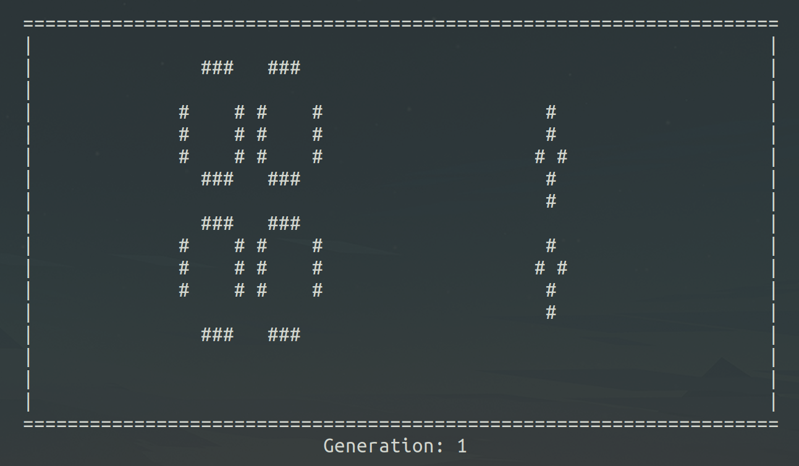
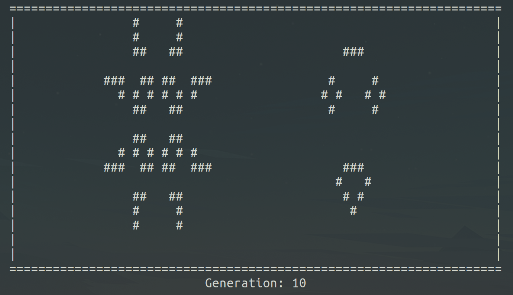
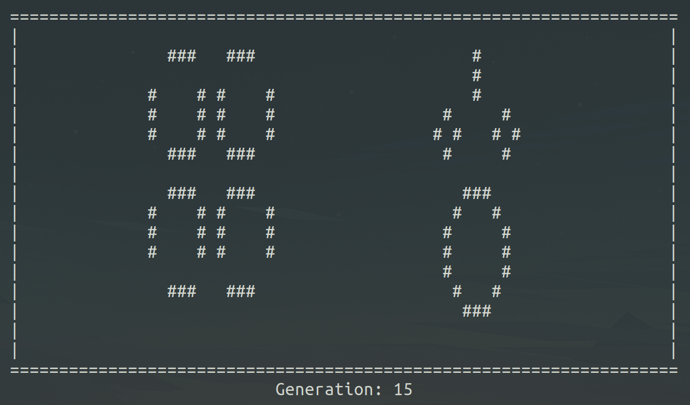
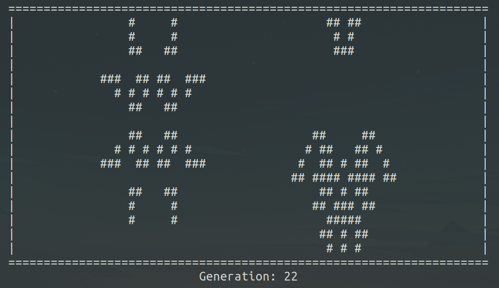
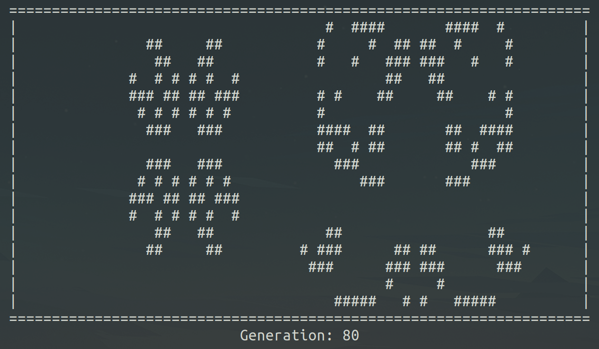
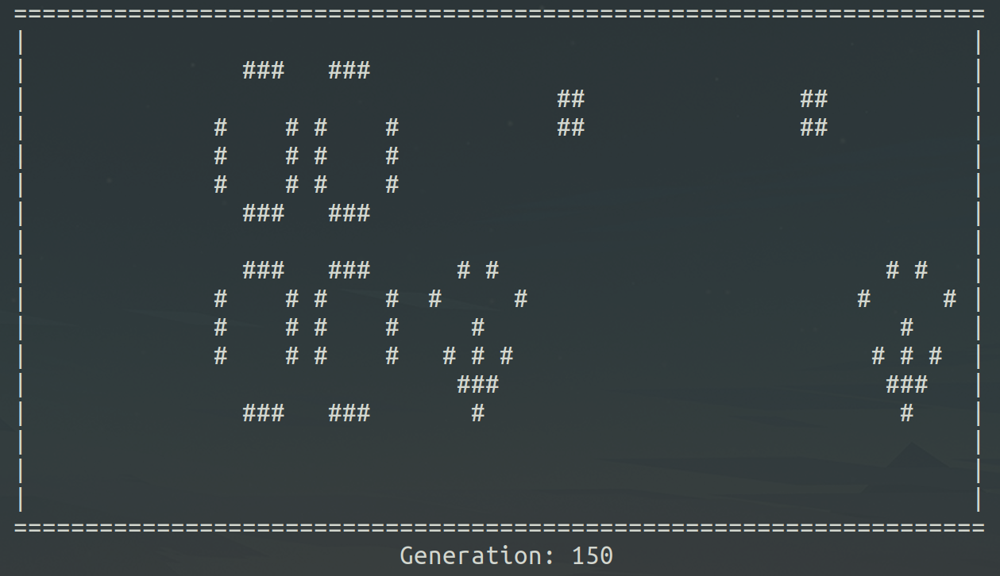

# Life

Students: Yehya Albakri

#

## Project Goal

The goal for this project is to write my own implementation for John Conway's Game of Life, also known as the zero-player game. This is a simulation game that operates on a grid of binary squares and a certain set of rules. According to Wikipedia, "Any live cell with fewer than two live neighbours dies, as if by underpopulation. Any live cell with two or three live neighbours lives on to the next generation. Any live cell with more than three live neighbours dies, as if by overpopulation." With these rules, the game can create some amazing emergent structures and seemingly living organisms. My lower bound for this project is a set starting configuration in C that abides by these rules. If I achieve this, a more ambitious bound would be to include additional abilities in the game such as speed adjustments and more complex game behaviors.

#

## Learning Goals

My main learning goal for this project is to understand how to work with 2D arrays to represent game data. With my previous project (Slytherin), I represented the snake as a doubly-linked-list and there was no need to create or scan a game board. I currently don't have an idea of how to check for neighbors of cells.

#

## Resources

The only resource I ended up using to create my game is the Wikipedia page on it (https://en.wikipedia.org/wiki/Conway%27s_Game_of_Life). The page outlines the rules of the game and emergent behaviors it's able to create. I referenced the rules to define them in terms of the code.

#

## Accomplishments

I was able to implement Conway's Game of Life using the following approach. The board is represented as a 2D array. At every scan of the board, any modifications made to the board are stored inside a temporary copy of the 2D array. The program iterates through the board and checks the surrounding elements to see if the cells are dead or alive and makes the necessary changes to the temporary board according to the rules of the game. An additional feature I decided to add that makes the game more fun is allowing the cells to loop through walls. Say that a type of spaceship is going towards a wall, rather than hitting the wall and dying, it can now come out the other side, making the game more perpetual and entertaining. Finally, I included a generation counter that tells you how long the game has been going for, adding one each time the game passes a generation of cells.
<br/>
<br/>
Below are some photos of a run given a starting configuration of the game.

### Starting Configuration



### Generation 10



### Generation 15



### Generation 22



### Generation 80



### Generation 150



#

## Design Decisions

There were three main design decisions that I had to make. My primary design decision and my motivation for this project is the method the program stores and deals with the game board. In my previous project (Slytherin), I stored my snake in the form of a doubly-linked-list. There was another possible method to deal with that and that's to store the snake in the form of a 2D array. In this game, I decided to explore that approach and implement Conway's Game of Life using a 2D array. I did this because it allows me to think in another frame of mind when designing how the program approaches and plays the game.

The second design decision that I made was making the game loop through the walls rather than hitting the wall and stopping. The reason for this decision is that the game board is really small, being the size of the terminal. A simulation would end relativly quickly if entities such as spaceships die upon hitting a wall. Looping takes advantage of this by making the game run longer, thus making it more entertaining.

The third major design decision that I made was deciding not to include a clickable interactive screen. I originally thought it wouldn't be too difficult to do so in C, that there would be a package for such a thing, but I was wrong. I couldn't find a resource that explains how to achieve that in C. All that came up for me was doing so in languages that have built-in display features such as C# and Javascript. I realized that if I were to keep digging around trying to find a way to add a mouse interface, I would spend more time trying to do that than actually implementing the game. Not only would that make it out of the scope of this project, but it would detract from my main project achievement and learning goals.

#

## Code Explanation

The following represents a sample check done by the game. Many such checks of similar structure occur throughout the game, but the idea is the same. There is a counter that starts at 0. In this case, it's checking the conditional if the current cell is dead. It checks the surrounding cells, adding one to the counter each time one of the surrounding cells is alive. Finally, if the count is equal to 3, according to the rules of the game on Wikipedia, then the current cell being scanned comes to life. This operation occurs in different scenarios, like if the current cell being scanned is dead or alive or if the cell being scanned is on the outside perimeter or not.

```
if (board[y][x] == 0)
{
    /* Adds to the count the number of surrounding cells of board[y][x] that equal 1. */
    count = 0;
    if (board[y - 1][x - 1] == 1)
    {
        count += 1;
    }
    if (board[y - 1][x] == 1)
    {
        count += 1;
    }
    if (board[y - 1][x + 1] == 1)
    {
        count += 1;
    }
    if (board[y][x + 1] == 1)
    {
        count += 1;
    }
    if (board[y + 1][x + 1] == 1)
    {
        count += 1;
    }
    if (board[y + 1][x] == 1)
    {
        count += 1;
    }
    if (board[y + 1][x - 1] == 1)
    {
        count += 1;
    }
    if (board[y][x - 1] == 1)
    {
        count += 1;
    }
    if (count == 3) /* Changes the cell at board[y][x] to 1 if there are exactly 3 living cells surrounding it. */
    {
        temp_board[y][x] = 1;
    }
}
```

#

## Reflection

I believe I acheieved most of my original learning goals. I had to modify my upper bound for the project because I realized it was kind of irrelevant to my project goal. The design decision was not to include a clickable interactive screen. I originally thought it wouldn't be too difficult to do so in C, that there would be a package for such a thing, but I was wrong. I couldn't find a resource that explains how to achieve that in C. All that came up for me was doing so in languages that have built-in display features such as C# and Javascript. I realized that if I were to keep digging around trying to find a way to add a mouse interface, I would spend more time trying to do that than actually implementing the game. Not only would that make it out of the scope of this project, but it would detract from my main project achievement and learning goals. Because I didn't do this, I ended up changing my upper bound to allowing the game to loop through the walls. I thought it was much more relevant to my implementation. Because the display resolution is so low, allowing cells to loop through the walls allowed me to get so much more out of the small display. A simulation can run for so much longer and look really cool because of the prepetual travel distance. Given that I achieved the lower bound of my project as well, I believe that I have achieved my learning goals.
